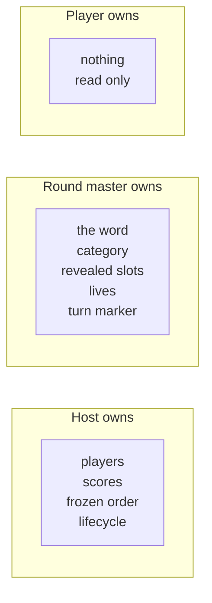
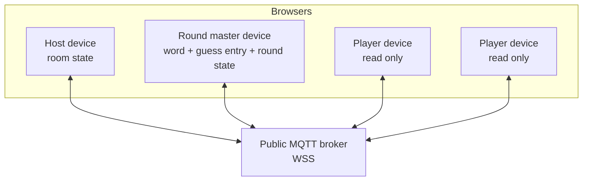
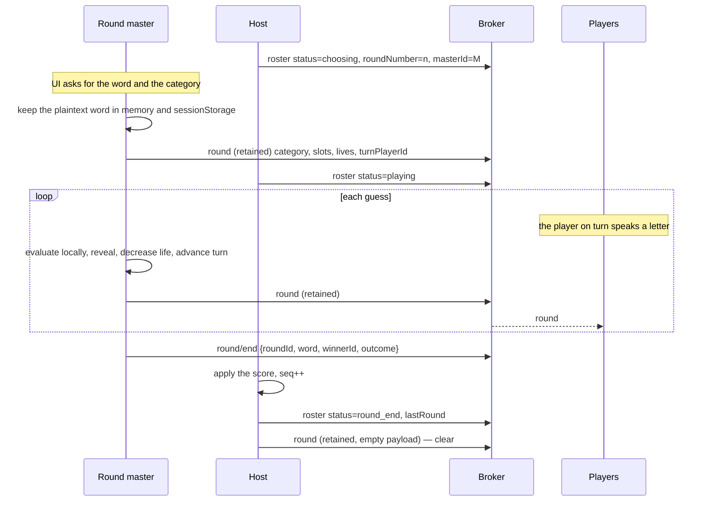

# Forca Multiplayer — Architecture

Version 1.0 — protocol `forca/v1`

A serverless multiplayer hangman ("forca") game. The game runs as a static React
application on GitHub Pages. Clients exchange all messages through a public MQTT
broker over secure WebSockets. There is no backend, no database and no session
store.

---

## 1. Design constraints

These constraints control every decision in this document.

| # | Constraint | Consequence |
|---|---|---|
| C1 | No backend. GitHub Pages serves static files only. | No server can hold authority, secrets or persistent state. |
| C2 | All traffic goes through a shared MQTT broker. | Any subscriber to `#` receives every message. |
| C3 | The application bundle is public. | Any credential in the bundle is public. |
| C4 | The secret word must stay secret. | The word must never be published before the round ends. |
| C5 | The room closes when the host disconnects. | No state survives the host. Rankings are lost unless exported. |
| C6 | Players sit together or share a voice channel. | The round master can type the guesses that players speak. |

---

## 2. Roles

The system has three roles. One person can hold more than one role. The host is
also a player, and the host becomes the round master when their turn arrives.

### 2.1 Host — room authority

The host creates the room and holds this role until the room closes. The host
owns the **room state**: the player list, the scores, the frozen turn order and
the room lifecycle.

The host does the following:

- Admits players into the room.
- Builds the frozen random player order.
- Starts and ends each round.
- Applies the score that the round master reports.
- Publishes the canonical room state.
- Closes the room.

The host does **not** touch the word, the guesses, the letters or the lives.

### 2.2 Round master — round authority

Each round selects the next player in the frozen order as the round master.

The round master types the secret word and the category on their own device. The
plaintext word stays in the memory of that device. The round master then runs the
whole round:

- Enters every guess that a player speaks.
- Evaluates the guess against the local word.
- Reveals the matched slots.
- Decreases the shared life pool on a miss.
- Advances the turn marker.
- Publishes the round state.
- Reveals the word and reports the winner when the round ends.

The round master does not guess in their own round.

### 2.3 Player

A player joins the room with the room name and the room key. A player speaks
their guess. The round master types it. A player device renders the state that
the host and the round master publish. A player device sends one message only:
the join request.

### 2.4 Why this split works

The word, the guess input and the evaluation all sit on one device. The word
therefore never crosses the network before the reveal, and no request/response
hop is needed to evaluate a guess. This removes a full network round trip per
guess, a timeout path, and an idempotency handshake.

The cost is that the round master device is a single point of failure for the
round. Section 9.1 covers that.



---

## 3. Topology



All devices connect to the same broker and subscribe to the same room topic
prefix. Message direction is a convention of the protocol, not a broker rule. The
broker applies no access control.

---

## 4. Transport

### 4.1 Broker

The browser can use MQTT over WebSockets only. Use the `mqtt.js` library. Use a
`wss://` endpoint.

The broker is a configuration value, not a security control. Ship a default and
let the user change it in the lobby screen.

| Broker | Endpoint | Notes |
|--------|----------|-------|
| HiveMQ public | `wss://broker.hivemq.com:8884/mqtt` | No credentials. Default. |
| EMQX public | `wss://broker.emqx.io:8084/mqtt` | No credentials. Fallback. |
| HiveMQ Cloud free | account endpoint | Credentials and topic ACL. See section 8.3. |

Practical room size is approximately 10 players. Public brokers apply rate limits
and connection limits.

### 4.2 Connection parameters

| Parameter | Value | Reason |
|-----------|-------|--------|
| `clean` | `true` | The room dies with the host. No session state is useful. |
| `clientId` | `forca-` + 16 random hex characters | Prevents a client ID collision on a shared broker. |
| `keepalive` | 30 s | Detects a dead client in approximately 45 s. |
| `reconnectPeriod` | 2000 ms | Recovers from a short network drop. |
| `protocolVersion` | 5, fall back to 4 | Some public brokers accept MQTT 3.1.1 only. |

### 4.3 Room identifier

Do not use the room name as a topic. The room name is human readable and easy to
guess.

```
roomId = base32( SHA-256( "forca/v1|" + normalize(roomName) + "|" + roomKey ) )[0..15]
```

`normalize` trims the string, folds it to lower case and collapses the internal
whitespace. Two people who type the same name and key reach the same room. A
person who knows the name only cannot compute the topic.

### 4.4 Topics

All topics carry the prefix `forca/v1/<roomId>/`.

| Topic | Publisher | Retain | QoS | Content |
|-------|-----------|--------|-----|---------|
| `room` | Host | Yes | 1 | Lifecycle and room metadata. Also the host Last Will. |
| `roster` | Host | Yes | 1 | Players, scores, frozen order, round pointer, status. |
| `round` | Round master | Yes | 1 | Live round state: category, slots, lives, turn marker. |
| `round/end` | Round master | No | 1 | Word reveal and the winner report. |
| `presence/<clientId>` | Any client | Yes | 1 | Client liveness. Also the client Last Will. |
| `join` | Player | No | 1 | Join request. |

Only three topics are retained state. `roster` and `round` together form the full
view. A client that joins late reads both retained messages and renders
immediately. No replay logic is needed.

Rules:

- Never retain `round/end` or `join`. A retained event message would replay to a
  late joiner and reveal a finished word or duplicate a player.
- Clear a retained topic with a zero length payload. The host clears `round` when
  a round ends and when the room closes.

### 4.5 Last Will and Testament

The Last Will implements constraint C5.

The host sets this Last Will at connect time:

```
topic:   forca/v1/<roomId>/room
retain:  true
qos:     1
payload: encrypted { v:1, status:"closed", reason:"host_lost" }
```

When the host connection dies, the broker publishes that message. Every client
receives `status:"closed"`, leaves the game screen and returns to the lobby. The
retained payload also stops a later joiner from entering a dead room.

Every client, host included, sets a second Last Will on `presence/<clientId>`
with `online:false`. This drives the connection indicator next to each name, and
it is how the host detects a lost round master.

Note: the client must encrypt the Last Will payload before it connects. The room
key is known at that moment, so this is possible.

---

## 5. Message security

### 5.1 What is protected, and what is not

Read this table before you trust the design.

| Asset | Protection | Residual risk |
|-------|-----------|---------------|
| The secret word | Never published before the reveal. It stays in the round master device memory. | The round master can lie about a result. |
| Guesses, category, names, scores | AES-GCM, key derived from the room key. | Any player holds the key, so any player can read everything. |
| Room membership | Topic identifier derived from name plus key. | A `#` subscriber sees that the room exists and sees the traffic volume. |
| Message timing and size | None. | An observer can infer the game pace and the word length. |
| Score integrity | None. | The host controls the scores. The round master reports the winner. No fix exists without a backend. |

### 5.2 Payload encryption

Encryption is mandatory. It is the only mechanism in this design that protects
message content.

Key derivation:

```
salt = UTF-8( "forca/v1/" + roomId )
key  = PBKDF2-HMAC-SHA256( password = roomKey, salt, iterations = 210000, length = 256 bit )
```

Derive the key once at join time with WebCrypto. Cache the `CryptoKey` in memory.
Never write the room key or the derived key to `localStorage`.

Envelope, as a binary MQTT payload:

```
byte 0        : envelope version (0x01)
bytes 1..12   : IV, 12 random bytes from crypto.getRandomValues
bytes 13..end : AES-GCM ciphertext and the 16 byte authentication tag
```

Use the full topic string as the AES-GCM additional authenticated data. This
binds a payload to its topic and blocks a cross-topic replay.

The plaintext is UTF-8 JSON. Every plaintext object carries these fields:

| Field | Purpose |
|-------|---------|
| `v` | Protocol version. Reject a mismatch. |
| `seq` | Monotonic counter, per topic. Reject a value that is not greater than the last accepted value. |
| `ts` | Unix milliseconds. Reject a value that differs from local time by more than 120 s. |
| `src` | Publisher client ID. |

A client that fails to decrypt a payload discards it in silence. A failed
decryption means a wrong room key or a foreign message. Do not show an error for
each failure. Show one lobby error if the first retained `room` message does not
decrypt, because that means the key is wrong.

### 5.3 The room key

The room key has two jobs:

1. It is an input to the room identifier, so it acts as the join gate.
2. It is the encryption password.

Share the key out of band. A shareable link may carry the room name in the URL
hash. The link must never carry the key.

---

## 6. Game model

### 6.1 Room state — published by the host

```ts
type RoomState = {
  v: 1
  seq: number
  ts: number
  status: 'lobby' | 'choosing' | 'playing' | 'round_end' | 'game_over'
  hostId: string
  config: { maxLives: number; livesResetEachRound: boolean }
  players: Array<{
    id: string
    name: string
    score: number
    connected: boolean
  }>
  order: string[]        // frozen random order of player IDs
  roundNumber: number    // 0 in the lobby, 1 for the first round
  masterId: string | null
  lastRound: { word: string; winnerId: string | null; voided: boolean } | null
}
```

### 6.2 Round state — published by the round master

```ts
type Slot =
  | { kind: 'letter'; char: string | null }   // char is null while hidden
  | { kind: 'fixed';  char: string }          // space, hyphen, apostrophe: always visible

type RoundState = {
  v: 1
  seq: number
  ts: number
  roundId: string        // UUID, generated by the round master
  roundNumber: number    // must match RoomState.roundNumber
  masterId: string
  category: string
  slots: Slot[]
  guessedLetters: string[]   // normalized, in guess order
  wrongLetters: string[]
  wrongWords: string[]
  livesRemaining: number
  turnPlayerId: string | null
  outcome: 'running' | 'won' | 'lost'
}
```

A client renders the screen from `RoomState` and `RoundState` together. A client
ignores a `RoundState` whose `roundNumber` does not match the `RoomState` value.
This blocks a stale retained round from a previous round.

### 6.3 Turn order

The host builds the order once, when the host starts the game:

- Take the player ID list.
- Shuffle it with Fisher-Yates.
- Draw each index from `crypto.getRandomValues`. Do not use `Math.random`.
- Publish the order in `RoomState`.
- Never rebuild the order while the room is open.

The order controls two separate rotations:

- **Round master rotation.** The host selects `order[(roundNumber - 1) % order.length]`.
- **Guess turn rotation.** The round master advances `turnPlayerId` through
  `order` and skips themselves.

A player who disconnects keeps their place in `order`. Both rotations skip a
player whose `connected` flag is false. The order itself never changes, which
satisfies your requirement.

### 6.4 Word handling and Portuguese accents

The game accepts free text, so it must handle accented Portuguese characters.

- Store the word exactly as the round master typed it. Use it for the reveal.
- Build a match key with `word.normalize('NFD').replace(/\p{Diacritic}/gu, '')`
  and then fold to upper case.
- Match a guessed letter against the match key. A guess of `C` therefore reveals
  `Ç`, and a guess of `A` reveals `Á`, `Ã` and `Â`.
- Reveal the accented character, not the folded character.
- Reveal every space, hyphen and apostrophe at round start. Mark those slots as
  `fixed`.
- Reject a word that has fewer than 2 letters. Reject a word that has more than
  40 characters.
- Trim the category. Reject an empty category.

### 6.5 Lives

Lives are a single shared pool. Every player draws from the same pool. The
default maximum is 6. The host sets the value in the lobby.

The round master owns `livesRemaining` and decreases it. Two behaviours are
available through `config.livesResetEachRound`:

- `true` (default): the pool resets to `maxLives` at the start of each round.
  This matches normal hangman.
- `false`: the pool carries across rounds. The game ends when it reaches 0.

The round master client decreases the pool automatically on a miss. The round
master UI also shows a manual `+` and `-` control, so the round master can
correct a mistyped guess. The round ends with `outcome: 'lost'` when
`livesRemaining` reaches 0.

### 6.6 Guess evaluation

The round master evaluates locally. No message is exchanged.

1. Normalize the guess. Fold the accents. Fold to upper case.
2. Reject a repeated letter. Show a local warning. Do not change the state.
3. For a letter guess: find every index in the match key. Reveal those slots with
   the original accented characters. A guess with zero matches is a miss.
4. For a word guess: compare against the whole match key. A wrong word is a miss.
   A correct word reveals every slot.
5. On a miss: append to `wrongLetters` or `wrongWords`, and decrease
   `livesRemaining`.
6. Set `outcome` to `won` when no `letter` slot holds `null`. Set it to `lost`
   when `livesRemaining` reaches 0.
7. Advance `turnPlayerId` on a hit and on a miss.
8. Publish the new `RoundState`.

### 6.7 Scoring

The player who reveals the last hidden letter, or who guesses the whole word,
gains 1 point. Nobody gains a point when the lives reach 0. The round master
never gains a point in their own round.

The round master reports the winner in `round/end`. The host applies the point
and publishes the new `RoomState`. The host is the only writer of a score, so no
two devices can disagree about the ranking.

The ranking is the player list sorted by score. The host screen offers a JSON or
clipboard export, because constraint C5 destroys the ranking when the room closes.

---

## 7. Protocol flows

### 7.1 Create and join

```mermaid
sequenceDiagram
    participant H as Host
    participant B as Broker
    participant P as Player
    H->>H: roomId = hash(name, key); derive AES key
    H->>B: connect, LWT on room (retained, closed)
    H->>B: publish room (retained) status=open
    H->>B: publish roster (retained) status=lobby
    P->>P: roomId = hash(name, key); derive AES key
    P->>B: connect, LWT on presence/<cid>
    P->>B: subscribe forca/v1/<roomId>/#
    B-->>P: retained room + retained roster
    P->>B: publish join {playerId, name}
    H->>H: add player, seq++
    H->>B: publish roster (retained)
    B-->>P: roster
```

A join fails in these cases. The client shows the reason and returns to the
lobby.

- No retained `room` message arrives within 5 s. The room does not exist.
- The retained `room` message does not decrypt. The key is wrong.
- `room.status` is `closed`. The host left.
- `roster.status` is not `lobby`. The game already started. Reject a late joiner,
  because the frozen order cannot accept a new member.

The player generates their own `playerId` and keeps it in `sessionStorage`. A
rejoin with the same ID restores the player row and the score.

### 7.2 A round



Notes on the flow:

- The word never appears on the wire until `round/end`. At that moment the round
  is over, so the reveal is harmless.
- There is no guess request and no guess response. The round master holds the
  word and the input, so it evaluates and publishes in one step. One message per
  guess.
- The host clears the retained `round` topic after it applies the score. This
  stops a stale round from reaching the next joiner.
- The host validates `round/end`: `roundId` must match the open round, and
  `winnerId` must be a connected player who is not the round master. The host
  ignores a message that fails either check.

### 7.3 Guess attribution

The round master types the guess for the player whose turn it is. The round
master UI preselects `turnPlayerId`. An override dropdown lets the round master
attribute the guess to a different player, because a player may speak out of
turn.

### 7.4 Turn indicator

`RoundState.turnPlayerId` drives the marker. Every client renders the symbol next
to that player. No extra message is needed.

---

## 8. Application architecture

### 8.1 Stack

| Concern | Choice | Reason |
|---------|--------|--------|
| Build | Vite, React 18, TypeScript | Static output. Fast build. |
| Routing | `HashRouter` | GitHub Pages has no SPA fallback. A path route returns 404 on reload. |
| State | Zustand | Small. No provider tree. Easy to drive from a socket callback. |
| MQTT | `mqtt.js` | The only mature browser MQTT client. |
| Crypto | WebCrypto | Native. No dependency. Needs a secure context, which Pages provides. |
| Deploy | GitHub Actions to Pages | Set `base: '/forca-multiplayer/'` in `vite.config.ts`. |

### 8.2 Module layout

```
src/
  net/
    topics.ts        roomId derivation, topic builders
    crypto.ts        PBKDF2 derivation, AES-GCM seal and open
    envelope.ts      version, seq, ts, replay checks
    mqtt.ts          connect, subscribe, publish, LWT, reconnect
  game/
    types.ts         RoomState, RoundState, Slot, message types
    roomReducer.ts   PURE: (RoomState, event) => RoomState      [host only]
    roundReducer.ts  PURE: (RoundState, word, guess) => RoundState [master only]
    words.ts         normalization, accent folding, slot building
    order.ts         seeded Fisher-Yates shuffle, turn advance
  roles/
    host/            useHostController, lobby control, score apply, order build
    master/          useRoundMaster, word entry, guess entry, life control
    player/          read-only view
  ui/
    Gallows.tsx  Slots.tsx  PlayerList.tsx  TurnMarker.tsx  Keyboard.tsx
  screens/
    Lobby.tsx  Room.tsx  RoundEnd.tsx  GameOver.tsx
```

The key rule: both reducers are pure. They import nothing from `net/`. Each takes
a state and an input and returns a new state. This lets you unit test the whole
game without a broker. Every network concern stays inside `net/`.

`roundReducer` takes the word as a parameter and never stores it in the published
state. This makes the leak impossible by construction: the publisher serializes
`RoundState` only, and `RoundState` has no word field.

### 8.3 Optional authenticated broker

You asked to combine payload encryption with an authenticated broker. The two are
not equal, so the design does not treat them as equal.

- Payload encryption is **mandatory**. It protects content.
- An authenticated broker is **optional configuration**. It does not protect
  content, because constraint C3 puts the credentials in the public bundle.

Use an authenticated broker for these benefits only:

- Strangers do not share your topic namespace.
- Rate limits and uptime are better than a public test broker.
- A topic ACL restricts a connection to `forca/v1/#`, so a leaked credential
  cannot reach an unrelated topic.

Implementation: read the endpoint, the user name and the password from
`import.meta.env`, and show them as editable fields in the lobby. Treat a
committed credential as public from the first day. Rotate it when you must.

---

## 9. Failure modes

### 9.1 The round master disconnects during a round

This is the main weakness of the design. The word exists on one device only. That
same device also drives the round. When the device dies, the round cannot
continue.

Handling:

1. The host detects the loss from the `presence` Last Will.
2. The host waits 15 s for a reconnection.
3. The host voids the round. No player gains a point.
4. The host publishes `RoomState` with `status: 'round_end'` and
   `lastRound.voided: true`.
5. The host clears the retained `round` topic.
6. The host starts the next round with the next master in the order.

Mitigation: the round master device writes the word and the `roundId` to
`sessionStorage`. A page reload therefore recovers the word, and the retained
`round` message recovers the rest of the round state. A tab close does not
recover.

Because the round state is retained on the broker, the other players keep a
correct view of the board while the host waits. Only the word is lost.

### 9.2 The host disconnects

Constraint C5 applies. The Last Will publishes `room.status = "closed"`. Every
client returns to the lobby. The scores are lost.

A short drop is different. `mqtt.js` reconnects within the keepalive window and
no Last Will fires. The host state lives in memory and survives the drop, so the
game continues.

A host page **reload** loses the game. This design accepts that, per your answer.
If you later want to survive a reload, mirror `RoomState` into `sessionStorage`
on every `seq` increment and reload it at start. That change is local to the host
controller and needs no protocol change.

### 9.3 A player disconnects

The `presence` Last Will sets `connected: false` in the next host snapshot. Both
rotations skip that player. The player keeps their place in `order` and keeps
their score. The player can rejoin with the same `playerId`.

### 9.4 Broker outage

`mqtt.js` retries. The UI shows a "reconnecting" banner and blocks all input. The
retained `roster` and `round` messages restore the view on reconnect, so no
replay is needed.

### 9.5 Duplicate and out of order messages

MQTT QoS 1 delivers at least once. Every handler must be idempotent.

- `roster` and `round`: accept only a `seq` greater than the last accepted `seq`
  for that topic.
- `round/end`: match on `roundId`. Discard a duplicate.
- `join`: match on `playerId`. A repeated join updates the name and does not add
  a row.

### 9.6 Two devices claim the same role

This cannot happen for the host, because only the room creator sets
`hostId`, and a second creator with the same name and key would produce a second
room on the same topic. Detect it: a client that sees a `roster` from a `src`
that is not `hostId` shows a "room conflict" error and disconnects.

For the round master, the host names `masterId` in `RoomState`. A client ignores
a `round` message whose `src` is not the current `masterId`.

---

## 10. Known limits

These are properties of the design, not defects. A backend is the only fix for
items 1 to 3.

1. **The round master is fully trusted.** The round master can report a miss for a
   letter that is present, or name the wrong winner. No client can detect it,
   because no client holds the word. A commitment scheme could detect it: the
   round master publishes `SHA-256(word + nonce)` at round start and reveals the
   nonce at round end. This adds real complexity. It is not in version 1.
2. **The host is fully trusted.** The host can change a score or the order.
3. **Any player can read all traffic.** Every player holds the room key, so every
   player holds the decryption key. This is acceptable, because the word is never
   published before the reveal.
4. **No persistence.** The ranking dies with the room. Export it before you close.
5. **No late join.** A player cannot join after the game starts, because the order
   is frozen.
6. **Public broker limits.** Expect approximately 10 players. Expect occasional
   packet loss and reconnection on a free public broker.
7. **Word length leaks through message size.** The slot array size is visible to
   anyone who counts the ciphertext bytes. Pad `RoundState` to a fixed size if
   this matters. It probably does not.

---

## 11. Open decisions

| Item | Options | Recommendation |
|------|---------|----------------|
| Word commitment hash | Add it, or trust the round master | Skip it in v1. Add it if a group actually cheats. |
| Host reload recovery | Accept the loss, or mirror to `sessionStorage` | Ship the loss. The mirror is a small, additive change. |
| Lives scope | Reset each round, or carry across the room | Ship reset each round as the default. Expose the toggle. |
| Guess entry | Round master only, per your answer | Keep it. Per-player entry would need a new `guess` topic and turn locking. |
| End of game | Fixed round count, or the host ends it | Ship a host button plus an optional "one round per player" limit. |
